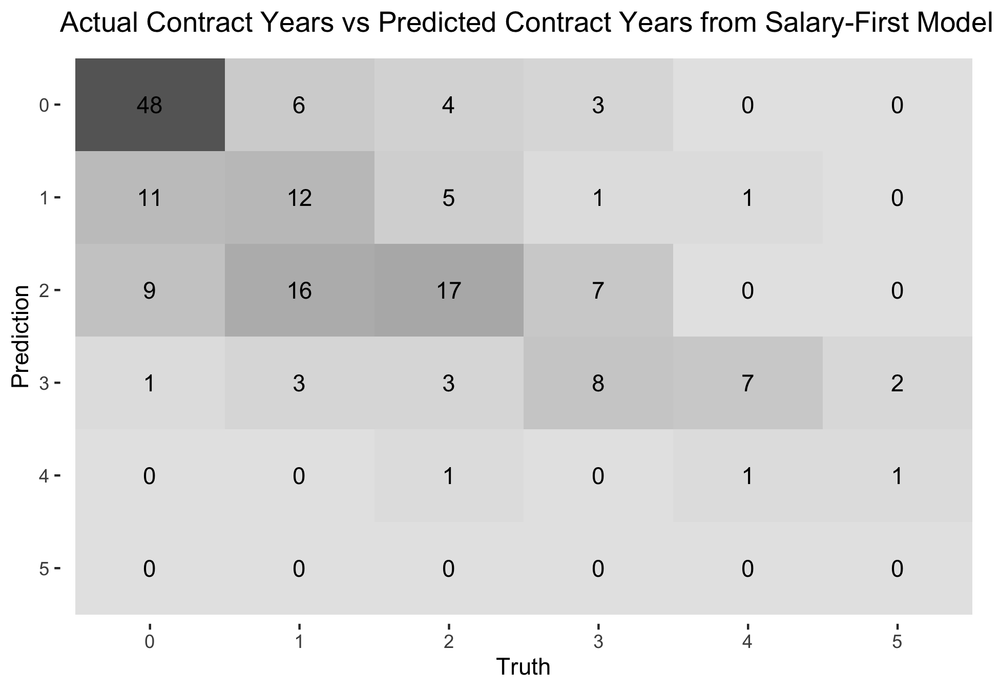

```{r setup, include=FALSE}
knitr::opts_chunk$set(cache=TRUE,
                      echo = TRUE,
                      warning = FALSE,
                      message = FALSE)
```

# Introduction

Day 1 of NBA free agency is by far the biggest day of the offseason for the league. While last year's class itself wasn't as star studded as 2019, it still provided plenty of drama with the COVID-19 pandemic still hanging around like an ominous cloud. The Milwaukee Bucks' trade for Bogdan Bogdanović of the Sacramento Kings was leaked before the official opening of the moratorium and subsequently backtracked, allowing the Atlanta Hawks to swoop in and sign Bogdanović to a [4-year, `$72M` contract](https://www.nba.com/news/report-hawks-sign-bogdan-bogdanovic-to-offer-sheet). Anthony Davis shut down speculation that he was going to take a shorter-term contract to maximize his earning potential in later years by agreeing to a [5-year, `$190M` maximum contract extension](https://www.espn.com/nba/story/_/id/30442167/anthony-davis-finalizing-five-year-190-million-maximum-contract-stay-los-angeles-lakers) with the Los Angeles Lakers. Jerami Grant desired a shot at being a Number 1 option, signing a [3-year, `$60M` contract](https://www.denverpost.com/2020/11/20/jerami-grant-pistons-reach-agreement-nuggets/) with the rebuilding Detroit Pistons after rejecting a similar deal to re-sign with the promising Denver Nuggets, who had reached the Western Conference Finals that year. And Gordon Hayward closed the fascinating Boston chapter of his NBA career, opting out of `$34.2M` and signing with the Charlotte Hornets to the tune of [4 years and `$120M`](https://www.cbssports.com/nba/news/celtics-hornets-complete-gordon-hayward-sign-and-trade-exchange-future-second-round-pick/).

*ADD SEGUE HERE*

What I wanted to do was predict what contracts this year's free agent class might get based off previous offseasons. Stars generally get star-type money, but in tiers below, contracts of comparable players usually come up in discussing contract value.

# Methods/Analysis

## Loading Packages

Let's start by loading required packages.
```{r load_pkgs, results="hide"}
if(!require(tidyverse)) 
  install.packages("tidyverse", repos = "http://cran.us.r-project.org")
if(!require(tidymodels)) 
  install.packages("tidymodels", repos = "http://cran.us.r-project.org")
#for cleaning variable names
if(!require(janitor)) 
  install.packages("janitor", repos = "http://cran.us.r-project.org")
#for multinomial regression
if(!require(glmnet)) 
  install.packages("glmnet", repos = "http://cran.us.r-project.org")
#ranger is random forest algorithm wrapper
if(!require(ranger)) 
  install.packages("ranger", repos = "http://cran.us.r-project.org")
#for variable importance
if(!require(vip)) 
  install.packages("vip", repos = "http://cran.us.r-project.org")
#zoo allows rolling operations
if(!require(zoo))
  install.packages("zoo", repos = "http://cran.us.r-project.org")
#matrix stats
if(!require(matrixStats)) 
  install.packages("matrixStats", repos = "http://cran.us.r-project.org")
#rpart.plot shows the decision tree of an rpart result
if(!require(rpart.plot)) 
  install.packages("rpart.plot", repos = "http://cran.us.r-project.org")
#kableExtra allows more customization of tables
if(!require(kableExtra)) 
  install.packages("kableExtra")
if(!require(RColorBrewer)) 
  install.packages("RColorBrewer", repos = "http://cran.us.r-project.org")
#for dark background plots
if(!require(ggdark)) 
  install.packages("ggdark", repos = "http://cran.us.r-project.org")
```

## Importing the Data

There are five files I'll import.
```{r load_stats}
#specify columns because otherwise birth year is read as logical
cols_for_stats=cols(
  .default = col_double(),
  player = col_character(),
  hof = col_logical(),
  pos = col_character(),
  lg = col_character(),
  tm = col_character()
)

advanced<-read_csv("Data/Advanced.csv",col_types = cols_for_stats) %>%
  select(seas_id:mp,ows:ws,vorp)
totals<-read_csv("Data/Player Totals.csv",col_types = cols_for_stats)
#max games per season for players on multiple teams
max_games_tots=totals %>% filter(tm=="TOT") %>% group_by(season,lg,tm) %>%
  summarize(max_games_tot=max(g,na.rm = TRUE)) %>% ungroup()
#max games per season for players on single team
max_games=totals %>% filter(tm !="TOT") %>% group_by(season,lg) %>%
  summarize(max_games_non_tot=max(g,na.rm = TRUE)) %>% ungroup()
#coalesce above two into one column in totals df
totals_enhanced=left_join(totals,max_games_tots) %>% left_join(.,max_games) %>%
  mutate(max_games_playable=coalesce(max_games_tot,max_games_non_tot)) %>% 
  select(-c(max_games_non_tot,max_games_tot))
advanced_and_totals<-left_join(totals_enhanced,advanced) %>%
  #if player played for multiple teams in season, only take total row
  mutate(tm=ifelse(tm=="TOT","1TOT",tm)) %>% 
  group_by(player_id,season) %>% arrange(tm) %>% slice(1) %>% 
  mutate(tm=ifelse(tm=="1TOT","TOT",tm)) %>% 
  arrange(season,player) %>%
  mutate(g_percent=g/max_games_playable*100,gs_percent=gs/g*100,.before=g) %>% 
  select(-c(gs,max_games_playable)) %>% 
  #filter for only last ten years for faster pre-processing
  filter(season > 2009) %>% ungroup()
```

```{r clean_environ,include=FALSE}
rm(cols_for_stats,advanced,totals,max_games_tots,max_games,totals_enhanced)
```

\newpage

For the statistical data, I've scraped total and advanced stats from Basketball-Reference and stored them in .csv files. The advanced stats I kept were cumulative (offensive win shares, defensive win shares and value over replacement player). This was actually part of a larger project to scrape complete statistics for teams, players and awards (the Kaggle dataset resides [here](https://www.kaggle.com/sumitrodatta/nba-aba-baa-stats)). To my knowledge, my dataset is unique in that it includes BAA stats and ABA stats, which is not really of use here. 

For players who played on multiple teams in one season, I kept their total stats and discarded the team-specific season portions. In the previous iteration of this project, we scaled games played and games started to a normal distribution due to fluctuations in games played between seasons caused by the COVID-19 pandemic. There was an initial desire to use totals to bake in availability/body fragility, but the shortened seasons would cause the model to declare all players to be fragile and underestimate their contract. We will convert the games started to a percentage of games played and we will change the games played to a percentage of maximum playable games. This maximum will differ for players who played for multiple teams in one season.

```{r load_train}
past_free_agents<-read_csv("Data/2016-2020 Free Agents.csv")
```
I've updated the free agents training set from last year to include the 2020 free agents. As a quick refresh:

* removed retired players and players who signed from overseas (wouldn't have any contract year data) from the dataset
* set contract years to zero and salary to zero for players who:
    + went overseas (not many, considering the pandemic)
    + had explicitly non guaranteed first years in their contracts (training camp deals, two ways, ten days, exhibit 10s)
    + had blanks in their contract terms cell
* included option years and partially guaranteed years in my calculation of contract years
    + looked at it as both sides (player and team) intending to see out the contract
* gathered year 1 salary for remaining players using [Spotrac](https://www.spotrac.com/nba/contracts/), Basketball-Reference or [Basketball-Insiders](http://www.basketballinsiders.com/nba-team-salaries-at-a-glance/):
    + Capology was previously my main source, but it wasn't updated when I started compiling the 2020 free agents
    + Spotrac became the new main source as it cost nothing to look at the current year salary
    + Basketball-Reference has a transaction timeline, which is ideal for players who were waived/played for multiple teams
    + when all other sources were exhausted, turned to Basketball-Insiders
* general housekeeping like adding suffixes (Jr., II, III) to certain players to match up with statistical data

```{r load_cap_hist}
#subtract one from year to match up with offseason in which contract was signed
salary_cap_hist<-read_csv("Data/Salary Cap History.csv") %>% mutate(season=season-1)
#create variable of first year salary as percentage of cap
#easier to compare across years
past_free_agents<-past_free_agents %>% select(-c(terms,Source)) %>% 
  left_join(.,salary_cap_hist) %>% 
  mutate(first_year_percent_of_cap=yr_1_salary/cap) %>% 
  select(-c(yr_1_salary,cap))
```

\newpage

The next file I used was salary cap history, also from Basketball-Reference. To somewhat normalize comparisons across years, I converted the first year salary to a percentage of the salary cap.

```{r load_eval}
current_fa<-read_csv("Data/Free Agents 2021.csv")
#separate out options to compare what players options get if declined
current_fa_options<-current_fa %>% filter(str_detect(type,"PO|CO")) %>% 
  select(-experience)
#make player options all declined (UFA's)
#make club options ufa or rfa depending on exp
current_fa<-current_fa %>%
  mutate(type=case_when((type=="PO"|(type=="CO" & experience >= 4))~"UFA",
                        (type=="CO" & experience < 4)~"RFA",
                        TRUE~type)) %>% 
  group_by(player) %>% select(-experience) %>% slice(1) %>% ungroup() %>% 
  mutate(first_year_percent_of_cap=NA)
```
The last file loaded is our evaluation set: the 2021 free agent class, retrieved from Spotrac. Since the deadlines for some option decisions are all the way until August 1 and I wanted to run my models before then, I decided to scrape Spotrac on **June 30** (subject to change based on how fast models can be run). I had to edit this dataset to match the Basketball-Reference names (mainly adding diacritics to European names). In addition, I filtered out players with options. Players who decline player options and players who have their team options declined with more than 3 years of experience become unrestricted free agents. Players with less than or equal to 3 years of experience and a declined team option become restricted free agents. I'll use this fact to see which players & teams might decline their option. 2022 salary amounts of players with options were added manually. 

In the GitHub repository where this project is located, a file called `free agents.r` has more details on exactly how I scraped the train set, evaluation set and the salary cap history.

## Retrospective on Last Year's Results

Before getting into pre-processing, we'll take a look at last year's results and see how the algorithms performed. We remove players who ended up not hitting the market due to them picking up their player option. Any player who was predicted but didn't end up in the free agent history must not have received a contract, so their NA's were replaced with zeroes.

```{r last_years_results_load, echo=FALSE}
non_options=read_csv("https://raw.githubusercontent.com/sumitrodatta/contract-prediction-2020/master/Non-Option%20Contracts.csv")
options=read_csv("https://raw.githubusercontent.com/sumitrodatta/contract-prediction-2020/master/Options.csv")
combined_predictions=bind_rows(non_options,options) %>% 
  clean_names() %>% 
  #take out totals since based on $115M cap
  select(-starts_with("total")) %>% 
  #convert option amount to percent of cap for consistency
  mutate(x2021_option_cap_percent=x2021_option/109.14) %>%
  select(-x2021_option) %>% 
  #join predictions with actual
  left_join(.,past_free_agents %>% filter(season==2020)) %>%
  select(-c(season,ws)) %>% 
  #filter out players who picked up player option
  filter(!(!is.na(x2021_option_cap_percent) & is.na(contract_yrs))) %>%
  replace_na(list(type="UFA",contract_yrs=0,first_year_percent_of_cap=0)) %>%
  mutate(contract_yrs=as.factor(contract_yrs),yrs_y1s2=as.factor(yrs_y1s2),
         yrs_s1y2=factor(yrs_s1y2,levels=0:5)) %>%
  mutate(across(contains("cap"),~round(.,digits=4)))
rm(non_options,options)
```

```{r accuracy,echo=FALSE}
y1s2_yr_acc=round(accuracy(combined_predictions,truth=contract_yrs,estimate=yrs_y1s2) %>% pull(.estimate)*100,2)
s1y2_yr_acc=round(accuracy(combined_predictions,truth=contract_yrs,estimate=yrs_s1y2) %>% pull(.estimate)*100,2)
```

The years accuracy of the years-first model was `r y1s2_yr_acc`%, while the years accuracy of the salary-first model was `r s1y2_yr_acc`%. Here's some confusion matrices on how each model handled the prediction of contract years.

```{r years_confusion_matrix,fig.show='hold',out.width="50%"}
y1_yr_heatmap=combined_predictions %>%
  conf_mat(data=.,truth=contract_yrs,estimate=yrs_y1s2) %>%
  autoplot(type="heatmap") +
  ggtitle("Actual Contract Years vs Predicted Contract Years from Years-First Model")
ggsave(filename = "Images/Years Predict v Actual, Y1S2 Model.png",plot=y1_yr_heatmap)
s1_yr_heatmap=combined_predictions %>%
  conf_mat(data=.,truth=contract_yrs,estimate=yrs_s1y2) %>%
  autoplot(type="heatmap") +
  ggtitle("Actual Contract Years vs Predicted Contract Years from Salary-First Model")
ggsave(filename = "Images/Years Predict v Actual, S1Y2 Model.png",plot=s1_yr_heatmap)


```
The incorrect predictions were skewed toward predicting more years than received as evidenced by the sum of the lower triangle being greater than the upper triangle (models forecasting one year contracts for players who didn't receive a contract, two years for players who got one year, etc).

Here are the worst misses for both models.

```{r last_yr_extreme_yr_misses,echo=FALSE}
combined_predictions %>% 
  mutate(abs_error_y1s2_yrs=abs(as.numeric(contract_yrs)-as.numeric(yrs_y1s2))) %>% 
  slice_max(abs_error_y1s2_yrs,n=5) %>% select(player,yrs_y1s2,contract_yrs) %>% kable()
combined_predictions %>% 
  mutate(abs_error_s1y2_yrs=abs(as.numeric(contract_yrs)-as.numeric(yrs_s1y2))) %>% 
  slice_max(abs_error_s1y2_yrs,n=5) %>% select(player,yrs_s1y2,contract_yrs) %>% kable()
```
Gray, Eubanks & Cheatham were all deemed out-of-the-league material by both models, but the trio ended up securing 3 year contracts. Gray & Cheatham actually signed their contracts so they could be used as salary filler in the [4-team trade that sent Jrue Holiday to Milwaukee](https://www.nba.com/news/pelicans-acquire-steven-adams-eric-bledsoe-in-4-team-trade-jrue-holiday-to-milwaukee) that sent the pair to the Oklahoma City Thunder. Gray and Cheatham were eventually waived a week after the trade. Eubanks was a bit player in the San Antonio Spurs rotation, averaging 14.4 minutes (12th on the team) & 5.8 points (10th). McLaughlin and Maker were the opposite: predicted to land 3-year contracts and not receiving any full offers. McLaughlin re-signed on a two-way contract with the Minnesota Timberwolves. Maker signed an Exhibit 10 contract with the Cleveland Cavaliers and ended up making the opening night roster, but he was waived after 8 games. Konchar was surprisingly locked up to a 4-year, \$ 9M contract by the Memphis Grizzlies when the salary-first model only had him getting a single year.

Let's shift our focus to the salary predictions. First, the residual mean squared errors.
```{r last_yr_results,echo=FALSE}
y1_rmse=rmse(combined_predictions,
             truth=first_year_percent_of_cap,
             estimate=y1s2_cap_percent) %>% 
  pull(.estimate)
s1_rmse=rmse(combined_predictions,
             truth=first_year_percent_of_cap,
             estimate=s1y2_cap_percent) %>%
  pull(.estimate)

tribble(
  ~model,~rmse,
  "Years-First",y1_rmse,
  "Salary-First",s1_rmse
) %>% kable()
```
The salary-first model has a lower RMSE than the the years-first model when predicting salary.

As we did with the years models, let's look at the most extreme salary misses.

```{r last_yr_extreme_sal_misses}
combined_predictions %>% 
  mutate(abs_error_y1s2_salary=abs(first_year_percent_of_cap - y1s2_cap_percent)) %>% 
  slice_max(abs_error_y1s2_salary,n=10) %>%
  select(player,y1s2_cap_percent,first_year_percent_of_cap) %>% kable()
combined_predictions %>% 
  mutate(abs_error_s1y2_salary=abs(first_year_percent_of_cap - s1y2_cap_percent)) %>% 
  slice_max(abs_error_s1y2_salary,n=10) %>% 
  select(player,s1y2_cap_percent,first_year_percent_of_cap) %>% kable()
```
Harrell, Gasol & Ibaka seemingly took less money in exchange for a greater shot at a championship ring. Ibaka went to the Los Angeles Clippers, while Gasol joined the Los Angeles Lakers. Harrell actually didn't even change cities, swapping Clipper blue for Laker purple across the hall. Anthony returned to Portland, repaying the faith the Trail Blazers showed in him when they extended a contract offer to him during the 2020 season. Whiteside didn't receive any competitive offers with his reputation as an "empty-stats" player, and returned to his old stomping grounds in Sacramento with a near-minimum contract in hand. Upon further research, Korkmaz actually wasn't a free agent, having signed a 2-year contract in 2019. Dragić received a "legacy" contract from the Miami Heat, a 2-year balloon deal to thank him for his years of service with a team option on the 2nd year to maintain flexibility. Robinson signing with the Sacramento Kings on a 1-year, \$ 2M contract was surprising, as his potential as a rangy 3 & D wing should have enticed championship contenders.

On a more positive note, here's some players on which the models were very close on.

```{r last_yr_extreme_sal_close}
combined_predictions %>% filter(contract_yrs %in% c(1:5) & yrs_y1s2 %in% c(1:5)) %>%
  mutate(abs_error_y1s2_salary=abs(first_year_percent_of_cap - y1s2_cap_percent)) %>% 
  slice_min(abs_error_y1s2_salary,n=10) %>%
  select(player,y1s2_cap_percent,first_year_percent_of_cap) %>% kable()
combined_predictions %>% filter(contract_yrs %in% c(1:5) & yrs_y1s2 %in% c(1:5)) %>%
  mutate(abs_error_s1y2_salary=abs(first_year_percent_of_cap - s1y2_cap_percent)) %>% 
  slice_min(abs_error_s1y2_salary,n=10) %>% 
  select(player,s1y2_cap_percent,first_year_percent_of_cap) %>% kable()
```
12 of the 20 closest predictions were for contracts that took up less than 5% of the salary cap. Notes on the remaining 8:

* Davis & Ingram re-signed on maximum contract extensions
* VanVleet epitomized the Toronto Raptors' challenging 2020 season in their makeshift home of Tampa Bay, exhibiting both peaks (a career- & franchise-high 54 points against the Orlando Magic in February) as well as valleys (shooting a league-worst 38.9% from the field for the entire season)
* Clarkson was a scoring machine off the bench for the Utah Jazz, eventually winning the Sixth Man of the Year award
* Boucher broke out, receiving votes for both the Sixth Man of the Year & the Most Improved Player awards and earning the nickname "Block Quebecois" for his ferocious shot-swatting prowess
* Bradley signed a 2-year deal with the Miami Heat with the expectation of being a defensive pest off the bench, but his season was beset by injuries and he was eventually traded to the Houston Rockets as part of a package to land Victor Oladipo
* Millsap provided a steady veteran presence to the Denver Nuggets, ceding minutes to young up-and-coming forward Michael Porter Jr. as well as trade deadline acquisition Aaron Gordon. This reduced role resulted in Millsap's scoring average falling below 10 points for the first time in thirteen seasons.
* Poeltl began the season on the bench for the San Antonio Spurs before being thrust into the starting lineup after the Spurs agreed to a buyout with LaMarcus Aldridge. He averaged career highs across the board, including minutes per game (26.7), rebounds per game (7.9) and points per game (8.6).

```{r remove_retrospective_vars,include=FALSE}
rm(y1_rmse,s1_rmse,y1_yr_heatmap,s1_yr_heatmap,s1y2_yr_acc,y1s2_yr_acc,combined_predictions)
```

## Data Exploration and Visualizations

Before we train models, let's see how some of the predictors and some of the targets interact.
First, let's see how our targets correlate with each other. I've created a box and whisker plot, as well as added the points themselves in a transparent layer with some random variation to differentiate between points.
```{r targets_corr, echo=FALSE, fig.align='center',out.width="100%"}
set.seed(1) #to make jitter reproducible
yrs_vs_sal=past_free_agents %>% 
  ggplot(aes(x=factor(contract_yrs),y=first_year_percent_of_cap)) + 
  geom_boxplot() + geom_jitter(alpha=0.1,width=0.2) + 
  labs(x="Contract Years",y="First Year Cap %") +
  scale_y_continuous(labels = scales::percent) +
  annotate("text",x=1.5,y=0.3,label=paste0("Correlation Coeff:\n",round(
    cor(past_free_agents$contract_yrs,
    past_free_agents$first_year_percent_of_cap),4))) +
  dark_theme_gray()
ggsave(filename = "Images/Contract Years Against First Year Salary.png",plot=yrs_vs_sal,
       width=7.5,height=3.75,units = "in")

```

The correlation coefficient is 0.77, which shows that the two targets are strongly and positively correlated. The median value of the first year cap % (middle line in each box) increases with an increase in contract length. The highest increase in first year cap % is between a 4-year and 5-year contract.

Next, let's see if an all-encompassing advanced statistic has a relationship with first year cap percentage. Win Shares represent how much a player has contributed to his team's wins by comparing his output to a marginal player. Higher win shares generally indicate a better player.

```{r ws_vs_salary, echo=FALSE, fig.align='center',out.width="100%"}
ws_vs_sal=past_free_agents %>%
  ggplot(aes(x=first_year_percent_of_cap,y=ws,color=factor(contract_yrs))) + 
  geom_point() +
  scale_colour_brewer(palette="RdYlGn") +
  labs(x="First Year Cap %",y="Win Shares",color="Contract Years") +
  annotate("text",x=0.05,y=12.5,
           label=paste0("Correlation Coeff:\n",round(
             cor(past_free_agents$ws,past_free_agents$first_year_percent_of_cap),4))) +
  dark_theme_gray()
ggsave(filename = "Images/Win Shares Against First Year Salary.png",plot=ws_vs_sal,
       width=7.5,height=3.75,units = "in")

```
With a correlation coefficient of 0.8121, win shares are highly correlated with first year cap percentage. This shouldn't be too groundbreaking: better players get paid more.

Finally, let's see how many contracts of each length were given in each offseason.

```{r contracts_by_season, echo=FALSE, fig.align='center',out.width="100%"}
contract_per_seas=past_free_agents %>%
  ggplot(aes(x=factor(season),fill=factor(contract_yrs))) +
  geom_bar(aes(y=..count../tapply(..count.., ..x.. ,sum)[..x..]), 
           position="dodge") +
  labs(x="Season",y="Percent of Contracts Given",fill="Contract Years") +
  scale_fill_brewer(palette="RdYlGn") +
  scale_y_continuous(labels = scales::percent) +
  dark_theme_gray()
ggsave(filename = "Images/Contract Lengths by Offseason.png",plot=contract_per_seas,
       width=7.5,height=4,units = "in")

```

It comes as no surprise that as contract length increases, the percent of contracts of that length given out decreases. Although in 2016, the amount of players who didn't receive contracts was lower than the amount who received 1, 2, or 4 year contracts. 2016 was the year of the cap spike, when the salary cap jumped from \$ 70 million to \$ 94 million. Similar to a lot of people with new-found money, teams spent somewhat recklessly.

```{r clean_plots,include=FALSE}
rm(yrs_vs_sal,ws_vs_sal,contract_per_seas)
```

## Pre-Processing

```{r pre_process}
create_data<-function(x){
  a<-advanced_and_totals %>% group_by(player_id) %>% 
    #three year sum
    mutate(across(-c(1:10,fg_percent,x3p_percent,
                     x2p_percent:e_fg_percent,ft_percent),
                  list(three_yrs=~rollapplyr(.,3,sum,partial=TRUE)),
                  .names="{col}_last_3_yrs")) %>%
    inner_join(.,x) %>%
    mutate(ws_per_48_last_3_yrs=ws_last_3_yrs/mp_last_3_yrs*48) %>%
    mutate(fg_percent_last_3_yrs=
             ifelse(fga_last_3_yrs==0,0,fg_last_3_yrs/fga_last_3_yrs),
           x3p_percent_last_3_yrs=
             ifelse(x3pa_last_3_yrs==0,0,x3p_last_3_yrs/x3pa_last_3_yrs),
           x2p_percent_last_3_yrs=
             ifelse(x2pa_last_3_yrs==0,0,x2p_last_3_yrs/x2pa_last_3_yrs),
           e_fg_percent_last_3_yrs=
             ifelse(fga_last_3_yrs==0,0,
                    (fg_last_3_yrs+0.5*x3p_last_3_yrs)/fga_last_3_yrs),
           ft_percent_last_3_yrs=
             ifelse(fta_last_3_yrs==0,0,ft_last_3_yrs/fta_last_3_yrs)) %>%
    #remove categories that aren't predictive vars or linear combo of others
    select(-c(hof,lg,pos,birth_year,tm,
              trb,trb_last_3_yrs,fg,fga,fg_last_3_yrs,fga_last_3_yrs)) %>%
    #convert contract year and last 3 year stats to per game (except games)
    mutate(across(c(mp,x3p:x3pa,x2p:x2pa,ft:fta,orb:pts),list(per_game=~./g)),
           .after="gs_percent") %>%
    select(-c(g,mp,x3p:x3pa,x2p:x2pa,ft:fta,orb:pts,ws)) %>% 
    mutate(across(mp_last_3_yrs:pts_last_3_yrs,list(per_game=~./g_last_3_yrs)),
           .after="gs_percent_last_3_yrs") %>%
    select(-c(g_last_3_yrs,mp_last_3_yrs:pts_last_3_yrs,ws_last_3_yrs)) %>% 
    ungroup() %>% mutate(contract_yrs=factor(contract_yrs,levels = 0:5)) %>%
    replace_na(list(fg_percent=0,x3p_percent=0,x2p_percent=0,
                    e_fg_percent=0,ft_percent=0))
  return(a)
}
```
I used regular season stats, although I do understand that some players get paid on the strength of playoff performance. I started off with contract year stats, because there's anecdotal evidence that players exert more effort in their contract year (*cough cough Hassan Whiteside*). All stats except for the advanced stats (OWS, DWS and VORP) were converted to per game. Percentages were left alone.

In addition to using contract year stats, I summed the past two years and the contract year.

Why I settled on 3 years:

* Players do get paid on past performance, so just using contract year stats was out of the question
* 2 years opens up the possibility of a fluke year
    + Kawhi would have his nine game season bring down his averages significantly from his Raptors season: adding another year somewhat lessens this effect
* On the other hand, it's quite unlikely that teams factor in stats from more than 4 years ago, a lot would have changed
    + the Trail Blazers didn't pay Carmelo to recapture his form of his 2013 year where he led the league in scoring (I would hope)
* Another reason I settled on 3 years is that I can keep the same model for restricted free agents
    + my thought is that the rookie year is a bonus: great if you did well, but doesn't matter in the grand scheme of things if you did poorly
    + rookie extension is more based on how you improved over the course of that initial contract
    + For example, if Luka Dončić had a worse rookie year but had the same level of play that he has achieved in his second and third year (as well as next year), I highly doubt that Dallas would offer him a significantly less amount of money due to that substandard rookie year
    
I performed the same processing on the three-year totals, using the three-year game total as the denominator for converting to per game. I had to calculate the three-year percentages, and also re-engineered the win shares per 48 minutes metric.

I removed categories that were linear combinations of one another. For example, total rebounds can be found by simply adding up offensive and defensive rebounds. I kept age and experience as predictor variables, but removed position because I felt it would ultimately reflect in the stats themselves.

I changed contract years from a numeric column to a factor/category column. This changes its prediction from a regression problem to a classification problem. A 2.5-year contract makes no sense, so it is in our best interest to discretize the years and store them as factors rather than round a regression result.

The final step was to replace missing values in the shooting percentages with zeroes. These NA's were originally due to lack of attempts.

```{r train_and_eval_sets}
train_set<-create_data(past_free_agents)
eval_set<-create_data(current_fa)
rm(advanced_and_totals,past_free_agents)
```
Since the models depend on contract year stats, these players were removed from the evaluation set:
```{r removed, echo=FALSE}
anti_join(current_fa,eval_set) %>% 
  select(player,type) %>% knitr::kable() %>%
  kable_styling(latex_options = "HOLD_position",fixed_thead = T) %>% row_spec(0,bold=T)
```

## Training Models

There is no need for a subset of the training set to be withheld as a test set before running the models on the evaluation set, because there is built-in cross validation. In the previous iteration of this project, I utilized leave-one-out cross validation since the dataset is relatively small (<1000 observations).  How this works is that the model is run excluding one observation. Then, the model attempts to predict the result of that excluded observation. This is repeated for every observation. However, on this run, I've decided to use k-fold cross validation. I'm hoping to get similar or even better results while cutting down significantly on training time.

As we saw in data visualization, the two target variables (contract years and first year salary as a percentage of the salary cap) are fairly well correlated, as they have a Pearson correlation coefficient of 0.77. The way I chose to handle this is:

* predict one target first without the other as a predictor
* choose the best model (be that a single model or an ensemble of multiple models)
* use the first target's predictions as an input to predict the second target

One potential problem is compounding errors. If there's an incorrect year prediction, it might lead to an incorrect salary prediction.

### The Models

I used a total of six models.

* linear regression model as a baseline for salary, and multinomial regression as a baseline for years
    + the separation is due to the classification/regression split
* k-nearest neighbors model: take the distance between the statistics of two players (the absolute value of the difference) and then take the average of the outcome variable of the k nearest neighbours
    + the intuition being that similar players get similar contracts
* decision tree model (`rpart`): maybe as a player passes certain statistical thresholds, their contract increases
    + only using for predicting the contract years; since there are so many different salary percentages, a solitary decision tree would either be useless or far too complicated
* random forest model (`ranger`): reduces instability by averaging multiple trees
    + costs interpretability as there is no tree diagram that is representative of the decisions made
* support vector machine model: attempt to separate classes with a hyperplane
    + support vectors are the points closest to the hyperplane, named as such because the hyperplane would change if those points were removed
    + I believe this image from Wikipedia succinctly explains an SVM
    
```{r svm_explain, out.width="50%", fig.cap="H1 does not separate the classes. H2 does, but only with a small margin. H3 separates them with the maximal margin. By User:ZackWeinberg, based on PNG version by User:Cyc - This file was derived from: Svm separating hyperplanes.png, CC BY-SA 3.0, https://commons.wikimedia.org/w/index.php?curid=22877598",echo=FALSE}
knitr::include_graphics("Images/SVM2.png")
```

```{r actual_values,include=FALSE}
actual_values=train_set %>% 
  select(1:4,contract_yrs,first_year_percent_of_cap)
```

### Predicting Years First, then Salary

We'll start by predicting years first and then salary with years as an input.

With caret, everything could be thrown into the train function: cross-validation, tuning, data, etc. Tidymodels is more explicit in its steps. The standard 10-fold cross validation is how the data is going to be resampled. In addition, we'll stratify selection, so there is sufficient data to predict all contract year lengths. A hypothetical (albeit unlikely) scenario that could occur without stratification is a fold could include all instances of restricted free agents (which are more rare) in the test portion, and none in the train portion. The chosen algorithm would be confused as to how to predict something for which it has no training.

Recipes is tidymodels' pre-processing package. The first step to change the roles of some variables. The season_id, season, player_id & player variables are of no use as predictors, but are useful to identify observations, so they are given the "id" role. Since we are predicting years first, the first_year_percent_of_cap variable will be removed. Finally, we will convert the free agent type column to a numeric column.

```{r y1_steps}
cv=vfold_cv(train_set,v=10,strata=type)
yr1_recipe=recipe(contract_yrs~.,data=train_set) %>% 
  update_role(seas_id:player,new_role="id") %>% 
  step_rm(first_year_percent_of_cap) %>% step_dummy(type)
```
